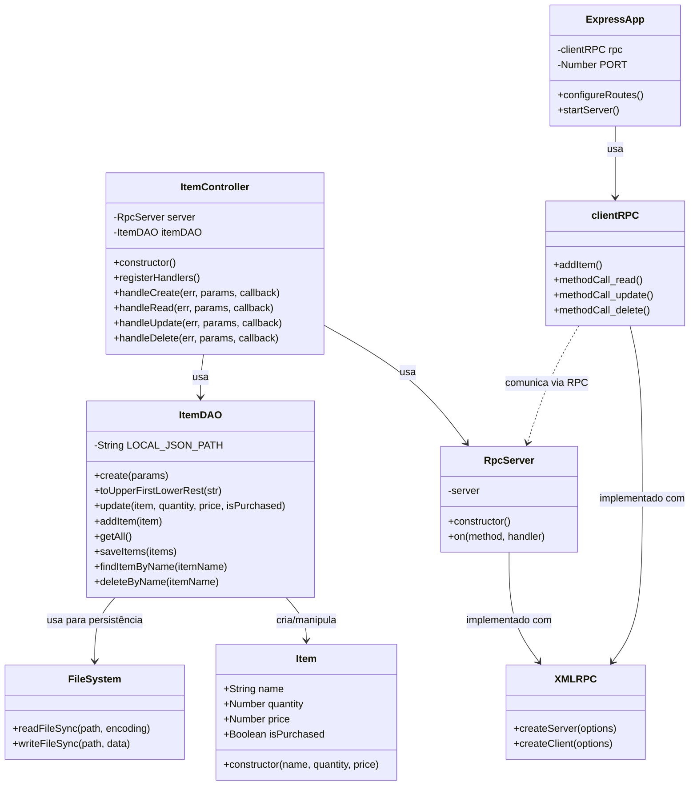

# 🛒 Lista de Compras - RPC

Este projeto implementa uma aplicação distribuída de lista de compras utilizando RPC (Remote Procedure Call) com XML-RPC. O sistema permite gerenciar itens de compras através de operações CRUD (Create, Read, Update, Delete) usando comunicação cliente-servidor.

## 📋 Índice

- [Características](#características)
- [Tecnologias Utilizadas](#tecnologias-utilizadas)
- [Pré-requisitos](#pré-requisitos)
- [Instalação](#instalação)
- [Como Executar](#como-executar)
- [Arquitetura](#arquitetura)
- [Diagrama de Classes](#diagrama-de-classes)
- [Funcionalidades](#funcionalidades)

## ✨ Características

- Comunicação cliente-servidor via XML-RPC
- Operações CRUD completas para gerenciamento de itens
- Persistência de dados em arquivo JSON local
- Interface web com Express.js
- Arquitetura modular e escalável

## 🚀 Tecnologias Utilizadas

- **Node.js** - Ambiente de execução JavaScript
- **Express.js** - Framework web para o cliente
- **XML-RPC** - Protocolo de comunicação remota
- **File System (fs)** - Persistência de dados em JSON

## 📦 Pré-requisitos

Antes de começar, certifique-se de ter instalado:

- [Node.js](https://nodejs.org/) (versão 12 ou superior)
- npm (geralmente vem com Node.js)

## 🔧 Instalação

1. **Clone o repositório:**
```bash
git clone https://github.com/StephanyeCunto/Lista_De_Compras_RPC.git
cd Lista_De_Compras_RPC
```

2. **Instale as dependências:**
```bash
npm install
```

## ▶️ Como Executar

### 1. Inicie o Servidor RPC

Em um terminal, execute:

```bash
node src/server/itemController.js
```

O servidor RPC ficará aguardando conexões na porta configurada.

### 2. Inicie a Aplicação Cliente (Express)

```bash
node src/client/expressApp.js
```

A aplicação web estará disponível no IP da máquina na rede local, permitindo acesso de outros dispositivos conectados à mesma rede:  
`http://<IP_DA_MAQUINA>:PORTA`  

> Exemplo: `http://192.168.1.5:3000`

## 🏗️ Arquitetura

O sistema é composto por:

- **Servidor RPC**: Processa as requisições e gerencia a lógica de negócio
- **Cliente Express**: Interface web que faz chamadas RPC ao servidor
- **Camada de Dados**: Persistência em arquivo JSON local

## 📊 Diagrama de Classes



### Descrição das Classes

#### Item
Classe modelo que representa um item da lista de compras.

**Atributos:**
- `name`: Nome do item
- `quantity`: Quantidade do item
- `price`: Preço do item (pode ser nulo)
- `isPurchased`: Indica se o item foi comprado

#### ItemDAO
Classe responsável pelo acesso e manipulação dos dados dos itens.

**Métodos principais:**
- `create`: Cria um novo item ou atualiza existente
- `update`: Atualiza propriedades de um item
- `getAll`: Retorna todos os itens
- `findItemByName`: Busca um item pelo nome
- `deleteByName`: Remove um item pelo nome

#### ItemController
Controla a lógica de negócio e gerencia as requisições RPC.

**Métodos principais:**
- `registerHandlers`: Registra os handlers para as operações CRUD
- `handleCreate/Read/Update/Delete`: Manipula as requisições RPC correspondentes

#### RpcServer
Implementa o servidor RPC que recebe chamadas remotas.

**Métodos:**
- `on`: Registra um handler para um método RPC específico

#### clientRPC
Cliente que faz chamadas ao servidor RPC.

**Métodos:**
- `addItem`: Faz uma chamada RPC para adicionar um item
- `methodCall_read`: Lê os itens
- `methodCall_update`: Atualiza um item
- `methodCall_delete`: Remove um item

#### ExpressApp
Aplicação web que fornece a interface para o usuário.

**Métodos:**
- `configureRoutes`: Configura as rotas HTTP
- `startServer`: Inicia o servidor Express

### Relacionamentos

- O `ItemController` utiliza o `RpcServer` para receber chamadas remotas
- O `ItemController` utiliza o `ItemDAO` para manipular os dados
- O `ItemDAO` manipula objetos do tipo `Item`
- O `clientRPC` se comunica com o `RpcServer` por meio de chamadas RPC
- O `ExpressApp` utiliza o `clientRPC` para fazer requisições ao servidor

  
## 📁 Estrutura do Projeto

```
Lista_De_Compras_RPC/
│
├── README.md                      # Documentação do projeto
│
└── src/
    ├── controller/
    │   ├── ExpressApp.js          # Aplicação Express (servidor web)
    │   └── ItemController.js      # Controlador de requisições RPC
    │
    ├── dao/
    │   └── ItemDAO.js             # Camada de acesso aos dados
    │
    ├── data/
    │   └── listItens.json         # Arquivo JSON para persistência
    │
    ├── dto/
    │   └── Item.js                # Data Transfer Object
    │
    ├── model/
    │   └── Item.js                # Modelo de dados do Item
    │
    ├── services/
    │   ├── RpcClient.js           # Cliente RPC
    │   └── RpcServer.js           # Servidor RPC
    │
    ├── view/
    │   ├── index.html             # Interface web principal
    │   ├── css/
    │   │   └── style.css          # Estilos da aplicação
    │   └── js/
    │       └── script.js          # Lógica do frontend
    │
    ├── node_modules/              # Dependências do projeto
    ├── package.json               # Configurações e dependências npm
    └── package-lock.json          # Lock das versões das dependências
```

### Descrição dos Diretórios e Arquivos

#### 📂 `src/controller/`
Contém os controladores da aplicação.

- **`ExpressApp.js`**: Servidor Express que gerencia as rotas HTTP e serve a interface web
- **`ItemController.js`**: Controlador que gerencia as requisições RPC e coordena as operações CRUD

#### 📂 `src/dao/`
Camada de acesso aos dados (Data Access Object).

- **`ItemDAO.js`**: Responsável pela manipulação e persistência dos dados no arquivo JSON. Implementa todas as operações de leitura e escrita.

#### 📂 `src/data/`
Armazena os dados persistentes da aplicação.

- **`listItens.json`**: Arquivo JSON onde os itens da lista de compras são salvos permanentemente

#### 📂 `src/dto/`
Data Transfer Objects - objetos para transferência de dados.

- **`Item.js`**: Objeto de transferência de dados para itens

#### 📂 `src/model/`
Define os modelos de dados da aplicação.

- **`Item.js`**: Classe modelo que representa um item da lista de compras com seus atributos (name, quantity, price, isPurchased)

#### 📂 `src/services/`
Serviços de comunicação RPC.

- **`RpcClient.js`**: Cliente que realiza chamadas RPC ao servidor
- **`RpcServer.js`**: Servidor XML-RPC que recebe e processa chamadas remotas

#### 📂 `src/view/`
Interface do usuário (frontend).

- **`index.html`**: Página HTML principal da aplicação
- **`css/style.css`**: Folha de estilos para a interface
- **`js/script.js`**: Lógica JavaScript do frontend para interação com o usuário

#### 📄 Arquivos de Configuração
- **`package.json`**: Configurações do projeto, scripts e dependências npm
- **`package-lock.json`**: Versões exatas das dependências instaladas
- **`README.md`**: Documentação completa do projeto


## 🎯 Funcionalidades

- ✅ **Criar Item**: Adicionar novos itens à lista de compras
- 📖 **Listar Itens**: Visualizar todos os itens cadastrados
- ✏️ **Atualizar Item**: Modificar quantidade, preço e status de compra
- 🗑️ **Deletar Item**: Remover itens da lista
- 💾 **Persistência**: Dados salvos automaticamente em arquivo JSON

## 📝 Estrutura de Dados

Cada item possui a seguinte estrutura:

```json
{
  "name": "Nome do Produto",
  "quantity": 2,
  "price": 15.50,
  "isPurchased": false
}
```


## 📄 Licença

Este projeto está sob a licença MIT.

---

⭐ Se este projeto foi útil para você, considere dar uma estrela no repositório!