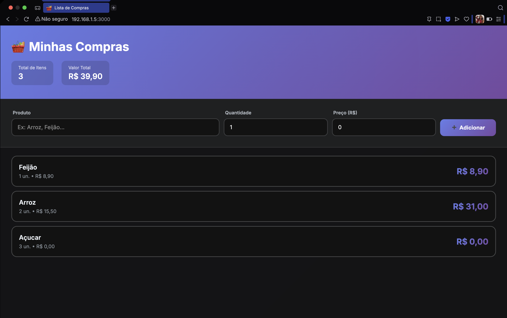
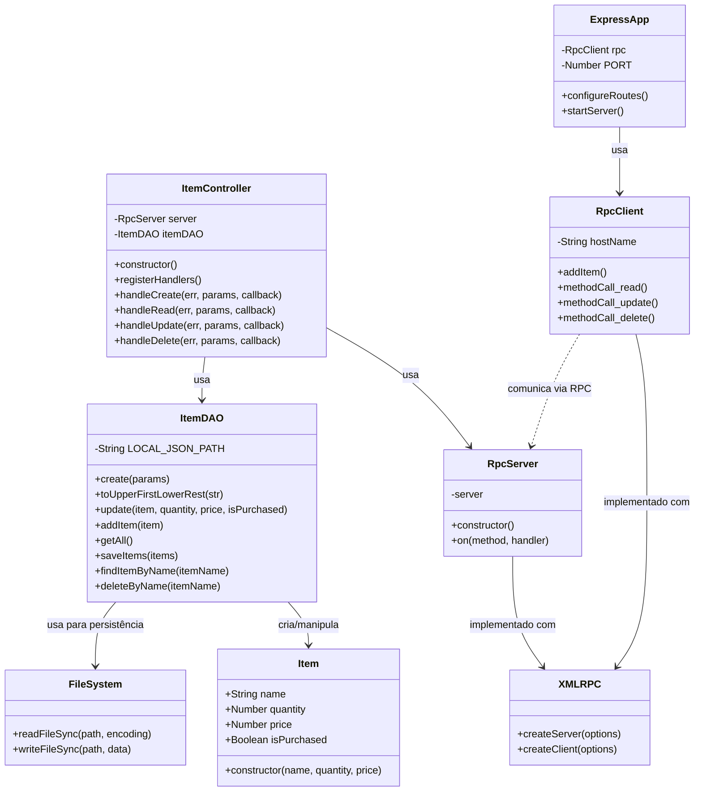

# 🛒 Lista de Compras - RPC

Este projeto implementa uma aplicação distribuída de lista de compras utilizando RPC (Remote Procedure Call) com XML-RPC. O sistema permite gerenciar itens de compras através de operações CRUD (Create, Read, Update, Delete) usando comunicação cliente-servidor.

  

## 📋 Índice

- [Características](#características)
- [Tecnologias Utilizadas](#tecnologias-utilizadas)
- [Pré-requisitos](#pré-requisitos)
- [Instalação](#instalação)
- [Configuração de Rede](#configuração-de-rede)
- [Como Executar](#como-executar)
- [Arquitetura](#arquitetura)
- [Diagrama de Classes](#diagrama-de-classes)
- [Funcionalidades](#funcionalidades)
- [Estrutura do Projeto](#estrutura-do-projeto)

## ✨ Características

- 🌐 Comunicação cliente-servidor via XML-RPC
- 📝 Operações CRUD completas para gerenciamento de itens
- 💾 Persistência de dados em arquivo JSON local
- 🖥️ Interface web responsiva com Express.js
- 🔗 Acesso via rede local (LAN)
- 🏗️ Arquitetura modular e escalável

## 🚀 Tecnologias Utilizadas

- **Node.js** - Ambiente de execução JavaScript
- **Express.js** - Framework web para o cliente
- **XML-RPC** - Protocolo de comunicação remota
- **File System (fs)** - Persistência de dados em JSON

## 📦 Pré-requisitos

Antes de começar, certifique-se de ter instalado:

- [Node.js](https://nodejs.org/) (versão 12 ou superior)
- npm (geralmente vem com Node.js)

## 🔧 Instalação

1. **Clone o repositório:**
```bash
git clone https://github.com/StephanyeCunto/Lista_De_Compras_RPC.git
cd Lista_De_Compras_RPC
```

2. **Instale as dependências:**
```bash
npm install
```

## 🌐 Configuração de Rede

Para que a aplicação funcione corretamente em sua rede local, você precisa configurar o endereço IP da máquina que está executando o servidor.

### 1️⃣ Descobrir o IP da sua máquina

#### No Windows:
```bash
ipconfig
```
Procure por "IPv4 Address" na seção da sua conexão de rede ativa.

#### No Linux/Mac:
```bash
ifconfig
# ou
ip addr show
```
Procure pelo endereço IP da interface ativa (geralmente `eth0` ou `wlan0`).

**Exemplo de resultado:**
```
IPv4 Address: 192.168.1.5
```

### 2️⃣ Configurar o IP no Cliente RPC

Abra o arquivo `src/services/RpcClient.js` e modifique o IP no construtor:

```javascript
export class RpcClient{
  constructor(){
    this.hostName = `192.168.1.5`; // ⬅️ ALTERE AQUI para o IP da sua máquina
  }
  // ... resto do código
}
```

**📸 Exemplo visual:**

```javascript
// ❌ ANTES (com IP de exemplo)
this.hostName = `192.168.1.5`;

// ✅ DEPOIS (com SEU IP)
this.hostName = `192.168.1.100`; // Use o IP que você descobriu
```

### 3️⃣ Configurar o IP na Interface Web

Abra o arquivo `src/view/js/script.js` e modifique a constante `API_BASE_URL`:

```javascript
const API_BASE_URL = 'http://192.168.1.5:3000'; // ⬅️ ALTERE AQUI para o IP da sua máquina
```

**📸 Exemplo visual:**

```javascript
// ❌ ANTES (com IP de exemplo)
const API_BASE_URL = 'http://192.168.1.5:3000';

// ✅ DEPOIS (com SEU IP)
const API_BASE_URL = 'http://192.168.1.100:3000'; // Use o IP que você descobriu
```

### 4️⃣ Configuração do Servidor RPC (já configurado)

O servidor RPC já está configurado para aceitar conexões de qualquer dispositivo na rede local:

```javascript
export class RpcServer{
    constructor(){
        try {
            // 0.0.0.0 permite conexões de qualquer IP na rede
            this.server = createServer({ host: '0.0.0.0', port: 9090 });
        } catch (err) {
            console.error("Erro ao iniciar o servidor RPC:", err);
        }
    }
}
```

> **💡 Nota:** O uso de `0.0.0.0` como host permite que o servidor aceite conexões de qualquer dispositivo na rede local. Não é necessário alterar esta configuração.

### ⚠️ Importante

- Os **três arquivos** devem usar o **mesmo endereço IP** da máquina que está executando o servidor
- Certifique-se de que o firewall permite conexões nas portas **3000** (Express) e **9090** (RPC)
- Todos os dispositivos devem estar na **mesma rede local**

### 🔒 Configurando o Firewall

#### Windows:
1. Abra o "Firewall do Windows Defender"
2. Clique em "Configurações Avançadas"
3. Crie regras de entrada para as portas **3000** e **9090** (TCP)

#### Linux (usando ufw):
```bash
sudo ufw allow 3000/tcp
sudo ufw allow 9090/tcp
```

## ▶️ Como Executar

### 1. Inicie o Servidor RPC

Em um terminal, execute:

```bash
node src/controller/ItemController.js
```

**Saída esperada:**
```
Servidor RPC rodando em 0.0.0.0:9090
```


### 2. Inicie a Aplicação Cliente (Express)

Em **outro terminal**, execute:

```bash
node src/controller/ExpressApp.js
```

**Saída esperada:**
```
Servidor Express rodando
```


### 3. Acesse a Aplicação

Abra o navegador e acesse:

`http://<IP_DA_MAQUINA>:PORTA`  

> **💡 Dica:** Outros dispositivos na mesma rede também podem acessar usando este endereço!

## 🏗️ Arquitetura

O sistema é composto por três camadas principais:

```
┌─────────────────────────────────────────────────────────────┐
│                      CLIENTE (Navegador)                     │
│                         Interface Web                         │
│                     (HTML + CSS + JS)                        │
└────────────────────────┬────────────────────────────────────┘
                         │ HTTP (porta 3000)
                         ▼
┌─────────────────────────────────────────────────────────────┐
│                    SERVIDOR EXPRESS                          │
│                    (ExpressApp.js)                           │
│                   Serve Interface Web                        │
└────────────────────────┬────────────────────────────────────┘
                         │ XML-RPC
                         ▼
┌─────────────────────────────────────────────────────────────┐
│                    SERVIDOR RPC                              │
│                  (ItemController.js)                         │
│                   Lógica de Negócio                          │
└────────────────────────┬────────────────────────────────────┘
                         │
                         ▼
┌─────────────────────────────────────────────────────────────┐
│                    CAMADA DE DADOS                           │
│                      (ItemDAO.js)                            │
│                 Persistência em JSON                         │
└─────────────────────────────────────────────────────────────┘
```

### Componentes:

- **Servidor RPC**: Processa as requisições e gerencia a lógica de negócio (porta 9090)
- **Cliente Express**: Interface web que faz chamadas RPC ao servidor (porta 3000)
- **Camada de Dados**: Persistência em arquivo JSON local (`listItens.json`)

## 📊 Diagrama de Classes



### Descrição das Classes

#### 📦 Item
Classe modelo que representa um item da lista de compras.

**Atributos:**
- `name`: Nome do item
- `quantity`: Quantidade do item
- `price`: Preço do item (pode ser nulo)
- `isPurchased`: Indica se o item foi comprado

#### 💾 ItemDAO
Classe responsável pelo acesso e manipulação dos dados dos itens.

**Métodos principais:**
- `create`: Cria um novo item ou atualiza existente
- `update`: Atualiza propriedades de um item
- `getAll`: Retorna todos os itens
- `findItemByName`: Busca um item pelo nome
- `deleteByName`: Remove um item pelo nome

#### 🎮 ItemController
Controla a lógica de negócio e gerencia as requisições RPC.

**Métodos principais:**
- `registerHandlers`: Registra os handlers para as operações CRUD
- `handleCreate/Read/Update/Delete`: Manipula as requisições RPC correspondentes

#### 🖥️ RpcServer
Implementa o servidor RPC que recebe chamadas remotas.

**Métodos:**
- `on`: Registra um handler para um método RPC específico

#### 📡 RpcClient
Cliente que faz chamadas ao servidor RPC.

**Métodos:**
- `addItem`: Faz uma chamada RPC para adicionar um item
- `methodCall_read`: Lê os itens
- `methodCall_update`: Atualiza um item
- `methodCall_delete`: Remove um item

#### 🌐 ExpressApp
Aplicação web que fornece a interface para o usuário.

**Métodos:**
- `configureRoutes`: Configura as rotas HTTP
- `startServer`: Inicia o servidor Express

### Relacionamentos

- O `ItemController` utiliza o `RpcServer` para receber chamadas remotas
- O `ItemController` utiliza o `ItemDAO` para manipular os dados
- O `ItemDAO` manipula objetos do tipo `Item`
- O `RpcClient` se comunica com o `RpcServer` por meio de chamadas RPC
- O `ExpressApp` utiliza o `RpcClient` para fazer requisições ao servidor

## 📝 Estrutura de Dados

Cada item possui a seguinte estrutura:

```json
{
  "name": "Arroz",
  "quantity": 2,
  "price": 15.50,
  "isPurchased": false
}
```

**Exemplo de arquivo `listItens.json`:**
```json
[
  {
    "name": "Arroz",
    "quantity": 2,
    "price": 15.50,
    "isPurchased": false
  },
  {
    "name": "Feijão",
    "quantity": 1,
    "price": 8.90,
    "isPurchased": true
  },
  {
    "name": "Açúcar",
    "quantity": 3,
    "price": null,
    "isPurchased": false
  }
]
```

## 📁 Estrutura do Projeto

```
Lista_De_Compras_RPC/
│
├── README.md                      # 📖 Documentação do projeto
│
└── src/
    ├── controller/
    │   ├── ExpressApp.js          # 🌐 Aplicação Express (servidor web)
    │   └── ItemController.js      # 🎮 Controlador de requisições RPC
    │
    ├── dao/
    │   └── ItemDAO.js             # 💾 Camada de acesso aos dados
    │
    ├── data/
    │   └── listItens.json         # 📄 Arquivo JSON para persistência
    │
    ├── dto/
    │   └── Item.js                # 📦 Data Transfer Object
    │
    ├── model/
    │   └── Item.js                # 📋 Modelo de dados do Item
    │
    ├── services/
    │   ├── RpcClient.js           # 📡 Cliente RPC (CONFIGURAR IP AQUI)
    │   └── RpcServer.js           # 🖥️ Servidor RPC
    │
    ├── view/
    │   ├── index.html             # 🎨 Interface web principal
    │   ├── css/
    │   │   └── style.css          # 💅 Estilos da aplicação
    │   └── js/
    │       └── script.js          # ⚙️ Lógica do frontend (CONFIGURAR IP AQUI)
    │
    ├── node_modules/              # 📦 Dependências do projeto
    ├── package.json               # ⚙️ Configurações e dependências npm
    └── package-lock.json          # 🔒 Lock das versões das dependências
```

### Descrição dos Diretórios e Arquivos

#### 📂 `src/controller/`
Contém os controladores da aplicação.

- **`ExpressApp.js`**: Servidor Express que gerencia as rotas HTTP e serve a interface web
- **`ItemController.js`**: Controlador que gerencia as requisições RPC e coordena as operações CRUD

#### 📂 `src/dao/`
Camada de acesso aos dados (Data Access Object).

- **`ItemDAO.js`**: Responsável pela manipulação e persistência dos dados no arquivo JSON. Implementa todas as operações de leitura e escrita.

#### 📂 `src/data/`
Armazena os dados persistentes da aplicação.

- **`listItens.json`**: Arquivo JSON onde os itens da lista de compras são salvos permanentemente

#### 📂 `src/dto/`
Data Transfer Objects - objetos para transferência de dados.

- **`Item.js`**: Objeto de transferência de dados para itens

#### 📂 `src/model/`
Define os modelos de dados da aplicação.

- **`Item.js`**: Classe modelo que representa um item da lista de compras com seus atributos (name, quantity, price, isPurchased)

#### 📂 `src/services/`
Serviços de comunicação RPC.

- **`RpcClient.js`**: Cliente que realiza chamadas RPC ao servidor ⚠️ **CONFIGURAR IP AQUI**
- **`RpcServer.js`**: Servidor XML-RPC que recebe e processa chamadas remotas

#### 📂 `src/view/`
Interface do usuário (frontend).

- **`index.html`**: Página HTML principal da aplicação
- **`css/style.css`**: Folha de estilos para a interface
- **`js/script.js`**: Lógica JavaScript do frontend para interação com o usuário ⚠️ **CONFIGURAR IP AQUI**

#### 📄 Arquivos de Configuração
- **`package.json`**: Configurações do projeto, scripts e dependências npm
- **`package-lock.json`**: Versões exatas das dependências instaladas
- **`README.md`**: Documentação completa do projeto


## 📄 Licença

Este projeto está sob a licença MIT.

---

⭐ Se este projeto foi útil para você, considere dar uma estrela no repositório!